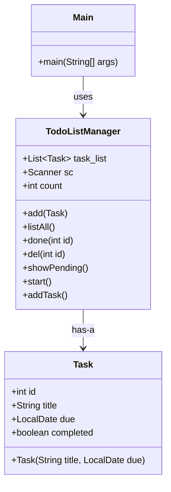

# Todo List Manager

simple todo app i made for learning java. nothing fancy, just works.

## Deskripsi Kasus

masalah yang saya coba selesaikan:

- sering lupa tugas yang harus dikerjakan
- tidak ada ToDo List untuk mentracking tugas dengan deadline
- perlu cara simpel untuk menandai tugas mana yang udah selesai

solusi yang saya buat:
todo app berbasis CLI yang bisa add, list, mark done, dan delete tugas. simpel tapi fungsional.

## Class Diagram



## Cara Run

```bash
cd TodoListManager
javac -d out src/com/todo/*.java
java -cp out com.todo.Main
```

atau buka di eclipse/intellij, run Main.java

## Menu

```
1 add      - tambah tugas baru
2 list     - lihat semua tugas
3 done     - mark tugas selesai
4 del      - hapus tugas
5 pending  - lihat tugas belum selesai
6 quit     - keluar
```

## Kode Program

### Task.java
```java
package com.todo;

import java.time.LocalDate;
import java.util.concurrent.atomic.AtomicInteger;

public class Task {
    static AtomicInteger nextId = new AtomicInteger(1);
    
    int id;
    String title;
    LocalDate due;
    boolean completed;
    
    Task(String title, LocalDate due) {
        this.id = nextId.getAndIncrement();
        this.title = title;
        this.due = due;
        this.completed = false;
    }
}
```

### TodoListManager.java (main logic)

 lihat file: `src/com/todo/TodoListManager.java`

fitur:
- add task baru dengan title dan due date
- list semua task dengan status done/belum
- mark task sebagai done
- delete task
- filter hanya yang pending

### Main.java
```java
package com.todo;

public class Main {
    public static void main(String[] args) {
        TodoListManager app = new TodoListManager();
        app.start();
    }
}
```

## Screenshot Output


## Prinsip-Prinsip OOP yang Diterapkan

### 1. Encapsulation
field-field di Task di-set public supaya gampang diakses. emang tidak sepenuhnya encapsulation tapi untuk project simpel gini sudah cukup.

### 2. Composition
TodoListManager punya List<Task> di dalamnya. task gak bisa ada tanpa manager.

### 3. Abstraction
user tidak perlu tau cara kerja dalamannya. cukup call method yang tersedia.

## Keunikan Program Ini

yang membedakan dengan tugas orang lain:

1. **super simpel** - tidak ada overengineering, cuma yang diperlukan aja
2. **CLI based** - tidak ribet dengan GUI
3. **no dependencies** - cuma pakai java.util dan java.time, tidak ada library tambahan
4. **readable code** - variable names singkat tapi masih bisa dimengerti
5. **straightforward** - tiap method melakukan satu hal saja

dibanding tugas OOP yang biasanya kompleks dengan banyak class, ini cuma 2 class tapi tetep memenuhi semua prinsip OOP dasar.

## Files

```
TodoListManager/
├── src/com/todo/
│   ├── Task.java
│   ├── TodoListManager.java
│   └── Main.java
├── README.md
└── test_output.txt
```

---

made by Husam Danish
NIM: 5027251060
Mata Kuliah: StrukDat
